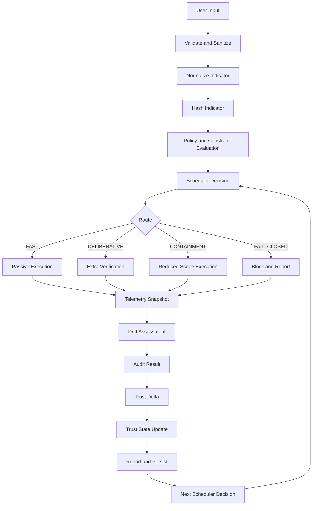
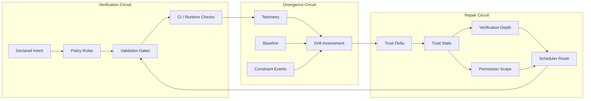
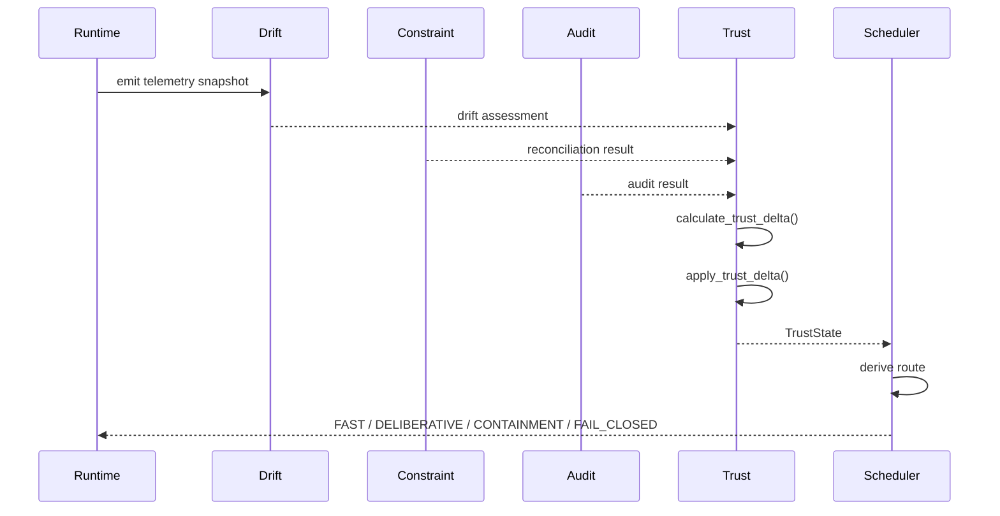
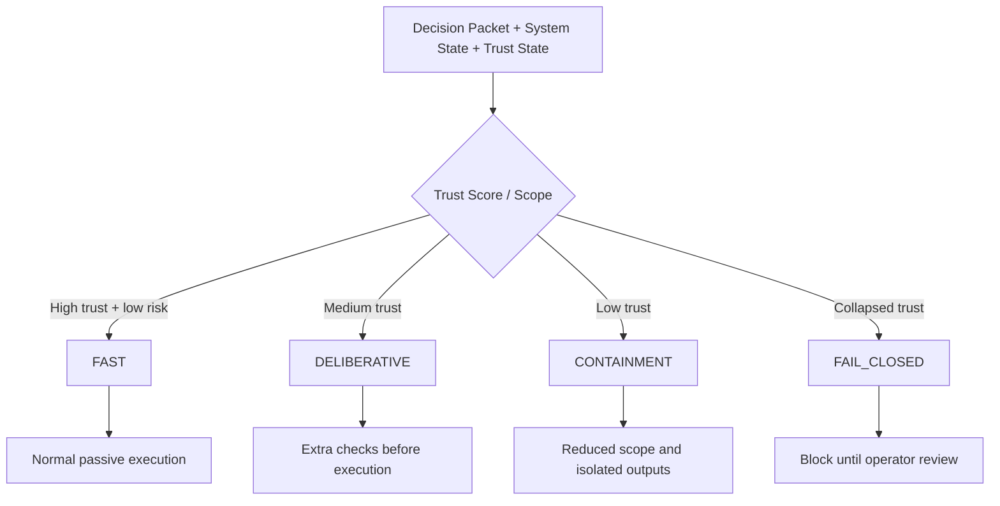
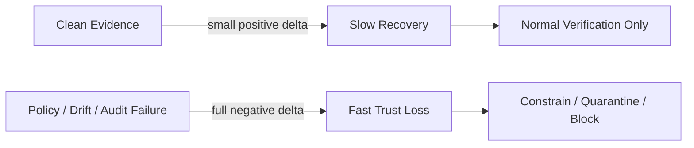

# Runtime Process Map

## Purpose

This process map shows how the Passive OSINT Control Panel evaluates runtime behavior across validation, drift detection, constraint reconciliation, audit logging, and trust scoring.

The first implementation of the self-healing trust fabric is intentionally bounded:

```text
observe → score → persist → report
```

It does not autonomously expand authority.

```text
Trust may reduce authority automatically.
Trust may not increase authority automatically.
```

## High-Level Runtime Loop



## Three Trust Circuits



## Trust Delta Lifecycle



## Scheduler Routing



## Trust Score Movement

Trust movement is asymmetric.



Positive evidence includes:

- clean drift assessment
- policy-compliant execution
- audit-safe payload
- passing CI
- reproducible output shape

Negative evidence includes:

- policy violation
- adversarial drift
- structural drift
- behavioral drift
- failed audit safety check
- CI or deployment failure

## Runtime Integration Point

The scheduler should accept trust state explicitly:

```python
schedule_decision(
    packet=decision_packet,
    state=system_state,
    trust_state=trust_state,
)
```

Routing should follow:

```text
high trust + low risk → FAST
medium trust → DELIBERATIVE
low trust → CONTAINMENT
collapsed trust → FAIL_CLOSED
```

## Current Implementation Boundary

Implemented in the first trust layer:

- `TrustDelta`
- `TrustState`
- `calculate_trust_delta()`
- `apply_trust_delta()`
- `derive_verification_depth()`
- `derive_permission_scope()`
- scheduler route derivation
- asymmetric trust recovery tests

Not implemented yet:

- automatic authority expansion
- autonomous policy mutation
- hardware trust propagation
- cross-component trust graph routing
- repair execution beyond observe/constrain/quarantine/rollback recommendation

## Control Rule

The trust fabric can make the system safer without granting new authority:

```text
High trust can preserve the current path.
Low trust can reduce scope.
Collapsed trust can fail closed.
No trust score can automatically grant a broader permission scope.
```
